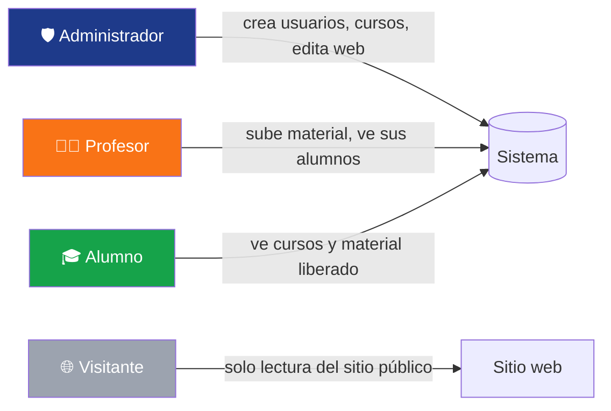
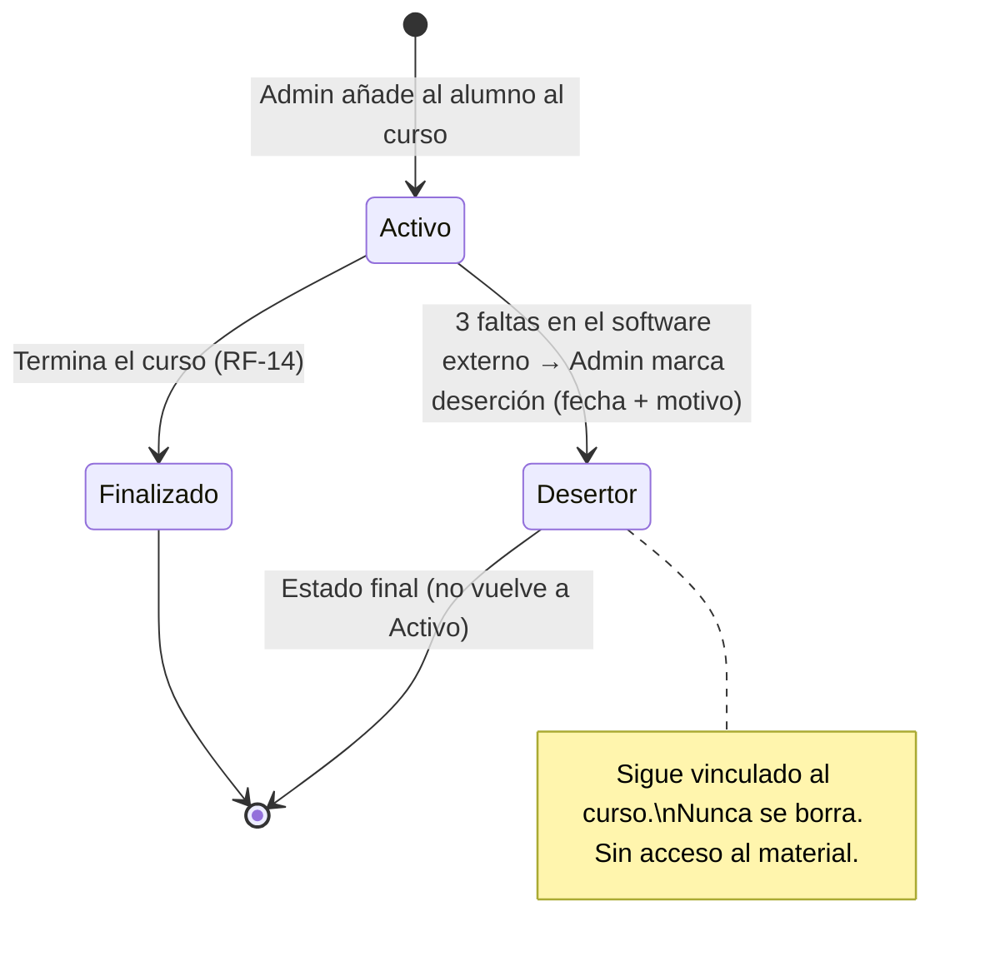
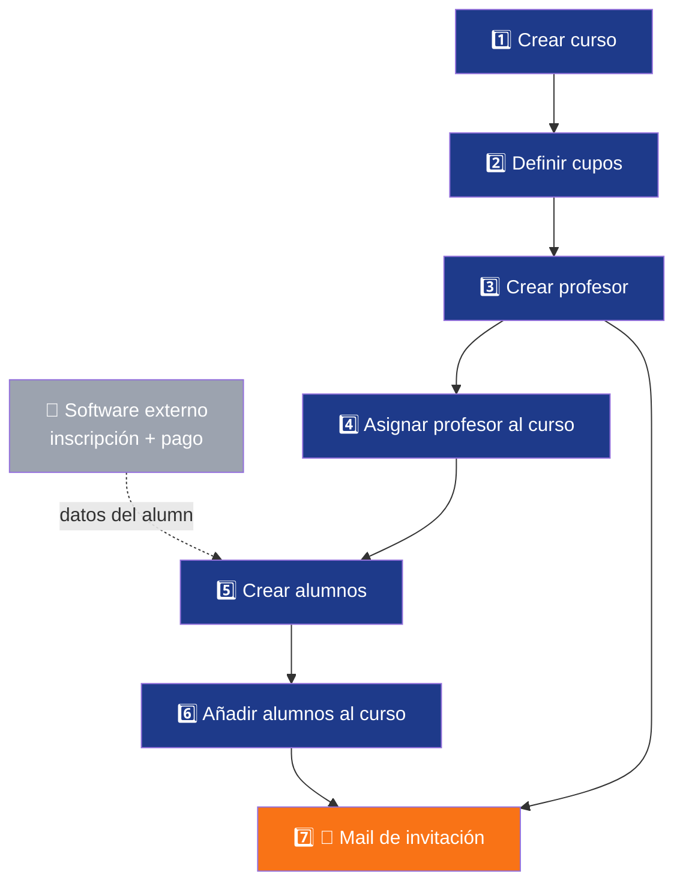
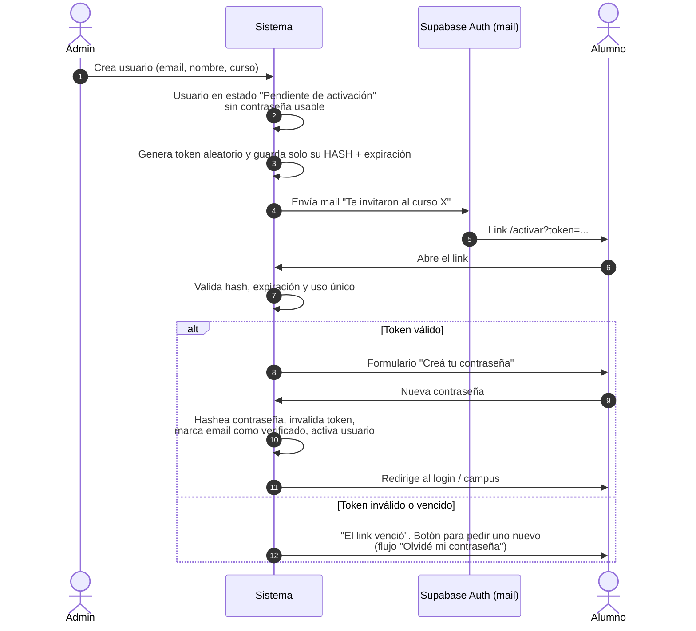

# 🔧 Recovery Parts — Especificación del Sistema

### Sitio web + Campus Virtual para Academia de Cursos Técnicos

*Documento base para agentes de desarrollo · Fuente: demo `recoveryparts/` + `Requerimientos_Academia_v2.docx` (10/09/2026)*

---

## 📑 Índice

- [0. Visión general](#0-visión-general)
  - [Roles y permisos](#-roles-y-permisos)
  - [Estados del alumno](#-estados-del-alumno)
  - [Seguridad y datos personales](#-seguridad-y-datos-personales)
- [A. Página web](#a-página-web)
  - [A1. Página de inicio](#a1-página-de-inicio)
  - [A2. Galería de fotos](#a2-galería-de-fotos)
  - [A3. Búsqueda de cursos/talleres](#a3-búsqueda-de-cursostalleres)
  - [A4. Página individual del curso](#a4-página-individual-del-curso)
- [B. Campus virtual](#b-campus-virtual)
- [C. Fuera de alcance](#c-fuera-de-alcance)
- [D. Preguntas abiertas](#d-preguntas-abiertas)
- [E. Guía para el agente](#e-guía-para-el-agente)

### 🏷️ Leyenda de estados

| Símbolo | Estado | Significado |
|:-:|---|---|
| 🟢 | **Confirmado** | El cliente lo pidió claramente. Se implementa. |
| 🟡 | **Pendiente** | Se necesita, pero falta definir el *cómo*. **Confirmar antes de implementar.** |
| 🔴 | **Cancelado** | El cliente lo descartó. **No implementar.** |
| ⛔ | **Excluido** | Queda fuera del alcance de este proyecto. |

---

## 0. Visión general

> [!IMPORTANT]
> **Proyecto real para un cliente.** El sistema maneja **datos personales de alumnos** (nombre, contacto, asistencia, estado académico). La **autorización por rol** debe aplicarse en el backend, en cada endpoint y en cada consulta. Ocultar botones en la interfaz **no alcanza**.

### 🏫 Contexto del negocio

| Dato | Valor |
|---|---|
| Aulas | **3** |
| Profesores | **10** |
| Área 1 | 🎨 **Creación y Diseño**: estampado, impresión 3D, cartelería, SEO de señalética |
| Área 2 | 🛠️ **Reparación y Tecnología** *(en v0.5: «Servicio Técnico y Tecnológico»)*: cursos de celulares, impresoras, notebooks, PC, televisores. **La academia no presta servicio técnico**: solo forma en estos oficios. |
| Productos | **Cursos** (varios meses) y **Talleres** (1–2 clases, especialización puntual) |
| Socio externo | **Mundo Par**: marketing y ventas. Vincula kits e insumos a los cursos por links |
| Sede | La Rioja 345, X5022 Córdoba |

**Objetivo:** reemplazar procesos manuales, como el envío de PDFs por WhatsApp y el seguimiento a mano de los alumnos que abandonan.

### 👥 Roles y permisos

Hay **3 tipos de usuario**:

#### Matriz de acceso

> ✅ = gestiona (crea/edita/borra) · 👁️ = solo ve · 🔒 = solo lo propio · ❌ = sin acceso

| Módulo | 🛡️ Admin | 👨‍🏫 Profesor | 🎓 Alumno | 🌐 Visitante |
|---|:-:|:-:|:-:|:-:|
| Contenido del sitio web (textos, imágenes, precios) | ✅ | 👁️ | 👁️ | 👁️ |
| **Creación de usuarios** | ✅ | ❌ | ❌ | ❌ |
| Cursos y talleres | ✅ | 🔒 👁️ | 🔒 👁️ | 👁️ *(ficha pública)* |
| Aulas, horarios y cupos | ✅ | 👁️ | ❌ | 👁️ *(cupos)* |
| Listado de alumnos | ✅ | 🔒 *(solo sus cursos)* | ❌ | ❌ |
| Material didáctico | ✅ | 🔒 ✅ | 🔒 👁️ *(liberado)* | ❌ |
| Kit por curso (informativo) | ✅ | 👁️ | 👁️ | 👁️ |
| Encuestas | ✅ | ❌ | 🔒 *(responder)* | ❌ |
| Reportes | ✅ | ❌ | ❌ | ❌ |

> [!WARNING]
> **Solo el administrador puede crear usuarios.** No hay registro público ni autorregistro. Profesores y alumnos reciben su acceso desde el panel de administración.

### 🎓 Estados del alumno

Hay **dos niveles** de estado:

| Nivel | Estado | Color | Descripción |
|---|---|:-:|---|
| **Por curso** (inscripción) | **Activo** | 🟢 | Cursa normalmente y ve el material de ese curso. |
| **Por curso** (inscripción) | **Desertor** | 🔴 | El Admin lo marca a mano cuando el software externo registra **3 faltas** (RF-15). **No se lo elimina del curso**: queda en el listado con este estado y se registran la **fecha**, el N° de clase y el **motivo** (texto libre, **obligatorio**). El alumno ve un **aviso en el campus** con ese motivo. **Estado final**: no vuelve a Activo y pierde el acceso al material de ese curso. Alimenta los reportes (RF-49, RF-55). |
| **Por usuario** (cuenta) | **Inactivo** | ⚫ | **Cuenta deshabilitada** por el Admin: **no puede entrar al campus**, en ningún curso. No borra datos ni inscripciones. El Admin puede reactivarla (RF-56). |

*Estado de la **cuenta** (independiente de los cursos):* `pendiente_activacion` → `activa` ⇄ `inactiva` (deshabilitada por el Admin).

> [!NOTE]
> El estado es **por curso**. Un alumno puede estar *Activo* en un curso y *Desertor* en otro.

> [!IMPORTANT]
> **Asistencia (decisión cerrada).** La academia registra las faltas en un **software de terceros**. Nuestro sistema **no registra ni cuenta faltas** y no se integra con ese software. Cuando ese software muestra **3 faltas**, el Admin entra al curso, busca al alumno y le cambia el estado.

> [!WARNING]
> **Nunca se elimina al alumno del curso por desertar.** Si se lo borrara, se perdería el dato para los reportes de deserción. Marcarlo como Desertor:
> - **Mantiene** el vínculo alumno ↔ curso, y el alumno sigue apareciendo en el listado con el badge 🔴.
> - **Guarda la fecha** de deserción, que carga el Admin (por defecto, hoy).
> - **Calcula automáticamente el N° de clase** en que desertó, a partir de esa fecha y del calendario del curso: *"Desertó en la clase 3 de 12"*. Ver RF-55.
> - **Exige un motivo** (texto libre) y le muestra al alumno un **aviso** en el campus con el motivo de la deserción.
> - **Quita el acceso** al material de ese curso. No afecta otros cursos del alumno ni su cuenta.

### 🔐 Seguridad y datos personales

- [ ] **Autorización en el servidor** en cada ruta y cada query (RBAC). Un profesor **nunca** puede leer alumnos de un curso ajeno.
- [ ] **Mínimo privilegio**: cada rol ve solo lo necesario.
- [ ] Contraseñas **hasheadas** (los maneja Supabase Auth). El usuario crea su propia contraseña con la invitación (B0.2); el Admin nunca la conoce.
- [ ] **Nunca** poner datos personales en URLs, query strings ni logs.
- [ ] **Auditoría**: registrar quién creó, editó o dio de baja usuarios, cursos, precios y estados.
- [ ] Sesiones con expiración y cookies `httpOnly` + `secure`.
- [ ] Cumplimiento de la **Ley 25.326** (Protección de Datos Personales, Argentina): finalidad, consentimiento y derecho de acceso/rectificación.
- [x] El material del curso se **visualiza y se puede descargar** mientras el alumno tenga acceso (RF-33, cambiado en v0.6). La descarga pasa por el servidor, que valida sesión, rol, liberación y que no sea desertor.

---

## A. Página web

> [!TIP]
> **Regla general del sitio público:** todos los detalles, textos, información, precios e imágenes de estas secciones **solo los modifica el Administrador** desde un dashboard/CMS (🟢 **RF-53**). El resto de los usuarios y los visitantes **solo pueden ver**.

### 🎨 Identidad visual

| Token | Muestra | Uso |
|---|:-:|---|
| Azul (primario) |  | Marca, headers, botones principales |
| Naranja (acento) |  | CTAs, glow del hero, destacados |
| Blanco |  | Fondos y superficies |

- 🟢 **RNF-01**: paleta azul, naranja y blanco, tomada de su Instagram.
- 🟢 **RNF-02**: imágenes **limpias**, sin exceso de texto superpuesto.
- 🟢 **RNF-03**: distinguir visualmente **Creación y Diseño** de **Reparación y Tecnología** sin perder consistencia de marca.

**Elementos globales (todas las páginas):**
- Navbar con logo, links (Inicio, Cursos, Galería, Contacto) y botón **"Campus"** que lleva al login.
- 🔴 **RF-41**: botón flotante de **WhatsApp** — cancelado en v0.6 (no se implementa).
- Footer con dirección, redes sociales, contacto y links.

---

### A1. Página de inicio

> Ruta demo: `/` → `src/app/page.tsx`

| # | Sección | Contenido |
|:-:|---|---|
| 1 | **Hero** | Imagen de fondo con overlay legible, glow naranja, título y subtítulo. **Doble CTA**: *Ver Cursos* y *WhatsApp*. |
| 2 | **Las dos áreas** | Dos bloques diferenciados (RNF-03): 🎨 Creación y Diseño / 🛠️ Reparación y Tecnología. Cada uno lleva a la búsqueda ya filtrada. |
| 3 | **Capacitaciones Destacadas** | Grilla de cursos destacados (el admin elige cuáles). Cada card muestra imagen, nombre, duración, **precio** y cupos. |
| 4 | **Construyendo Profesionales** | Egresados en bento grid (2 destacados 2×2 + 8 simples), con nombre y especialidad. |
| 5 | **Nosotros / Stats** | Qué es la academia y números (aulas, profesores, egresados). |
| 6 | **Testimonios** | Foto, nombre, curso y puntaje ⭐. |
| 7 | **FAQ** | Preguntas frecuentes en acordeón. |
| 8 | **Contacto** | 🟢 **RF-42**: formulario que **notifica por mail** y deja la consulta visible para el personal interno. |

<b>✏️ Campos editables por el Admin</b>

- Imagen, título, subtítulo y textos de los CTA del hero
- Textos e imágenes de las dos áreas
- Qué cursos aparecen como destacados, y en qué orden
- Egresados: foto, nombre y especialidad (alta, baja y orden)
- Números de stats
- Testimonios: alta, baja y edición
- Preguntas y respuestas del FAQ
- Datos de contacto, WhatsApp, dirección y redes

**Criterios de aceptación**
- [ ] Todo el contenido sale del CMS; no queda nada hardcodeado.
- [ ] Los precios se muestran en las cards de destacados.
- [ ] El formulario de contacto envía el mail y guarda la consulta.
- [ ] Responsive, sin scroll horizontal en mobile.

---

### A2. Galería de fotos

> Ruta propuesta: `/galeria` · En la demo existe `components/sections/Gallery.tsx` y la sección `#egresados`.

| Elemento | Detalle |
|---|---|
| **Categorías / filtros** | Aulas · Clases en acción · Trabajos de alumnos · Egresados · Eventos |
| **Layout** | Bento grid / masonry, con lazy loading |
| **Lightbox** | Click para ampliar, navegación ← →, cierre con Esc |
| **Metadatos** | Descripción corta y área (Diseño / Técnico) |
| **Calidad** | Imágenes limpias (RNF-02) en formato optimizado (WebP/AVIF) |

<b>✏️ Campos editables por el Admin</b>

- Subir, eliminar y reordenar fotos
- Asignar categoría y área
- Texto alternativo (accesibilidad) y descripción

> [!CAUTION]
> Las fotos de **alumnos o egresados** requieren **consentimiento de uso de imagen**. Los datos de la demo (nombres y caras) son ficticios y deben reemplazarse.

---

### A3. Búsqueda de cursos/talleres

> Ruta demo: `/cursos` → `src/app/cursos/page.tsx` (*Catálogo de Cursos*)

| Elemento | Detalle |
|---|---|
| **Buscador** | Texto libre por nombre o palabras clave |
| **Filtros** | Área (Diseño / Técnico) · Tipo (**Curso** / **Taller**) · Nivel · Día/horario · Modalidad (presencial) |
| **Card** | Imagen · Nombre · Área · Duración · Días/horario · 💲 **Precio** · 🔥 Cupos |
| **Orden** | Destacados · Próximos a iniciar · Precio |
| **Vacío** | Mensaje del tipo "No encontramos cursos" + CTA a WhatsApp. También puede registrar el interés (RF-52). |

- 🟢 **RF-29**: el **precio siempre visible**.
- 🟢 **RF-27**: mostrar cupos y generar urgencia (*"¡Quedan 3 lugares!"*).
- 🟢 **RF-22**: los talleres son un **producto separado** de los cursos, con su badge propio.

**Criterios de aceptación**
- [ ] Los filtros se combinan y se reflejan en la URL (sin datos personales).
- [ ] Los cursos dados de baja no aparecen.
- [ ] Los cupos se calculan en tiempo real desde el campus.

---

### A4. Página individual del curso

> Ruta demo: `/curso` → `src/app/curso/page.tsx` (ej. *Reparación de iPhone*). Ruta final: `/cursos/[slug]`.

| Bloque | Contenido | Req. |
|---|---|:-:|
| **Hero** | Nombre, área, tipo, imagen técnica con overlays | — |
| **Descripción** | Qué se aprende y para quién es | 🟢 RF-25 |
| **Plan de Estudios** | **Solo los títulos de los módulos** del curso, en orden (sin clases ni material). Los talleres no muestran temario. *Cambiado en v0.12.* | 🟢 RF-26 · RF-58 |
| **Profesor** | Mini-CV: foto, experiencia, certificaciones | 🟢 RF-25 |
| **Requisitos previos** | Conocimientos o herramientas necesarias | 🟢 RF-25 |
| **Media** | Imágenes y video del aula y de las clases | 🟢 RF-25 |
| **Testimonios** | Foto y puntaje ⭐ | 🟢 RF-25 |
| **Sidebar "Inversión"** | 💲 **Precio** (y descuento si hay), días, horario, aula, duración, cupos | 🟢 RF-29 · RF-27 |
| **Kit necesario** | Lista de ítems del kit (ej. soldador, estaño, cable) con **precio de cada uno** y total. Cada ítem tiene un link de compra al software externo. Lo carga el Admin. | 🟢 RF-45 · RF-46 |
| **CTA** | Consultar por WhatsApp (enlace a chat, sin botón flotante ni bot) | 🟢 |

> [!NOTE]
> En la demo el sidebar muestra *$25.000 de inscripción + 3 cuotas de $65.000*. Aquí solo se **muestran** precios; el **cobro y la inscripción están excluidos** (ver [C](#c-fuera-de-alcance)).

**Criterios de aceptación**
- [ ] Toda la ficha es editable por el Admin.
- [ ] El temario público nunca expone el material del campus ni los títulos de las clases.
- [ ] El bloque del kit aparece solo si el curso tiene kit cargado.
- [ ] Los links de compra abren el software externo en una pestaña nueva.

---

## B. Campus virtual

> Ruta demo: `/login` + `/plataforma` → `src/app/plataforma/page.tsx`
> La demo tiene 3 vistas: **Resumen Técnico** (alumno), **Panel del Profesor** y **Panel de Administración**. El *switcher* de roles es solo para la demo y **no va al producto final**.

### B0. Paneles por rol

<table>
<tr>
<th>🎓 Alumno</th><th>👨‍🏫 Profesor</th><th>🛡️ Administrador</th>
</tr>
<tr valign="top">
<td>

- Mis cursos (RF-08, RF-11)
- Próximas clases (RF-09)
- Material liberado (RF-10)
- Encuesta de fin de curso

</td>
<td>

- Mis cursos: horario, aula y alumnos (RF-04)
- Subir material (RF-05, RF-36)
- Liberar contenido (RF-07)
- Temario y calendario (RF-31)

</td>
<td>

- Usuarios (alta, edición y baja)
- Cursos, talleres, aulas y horarios
- Precios y descuentos
- Insumos y stock
- Encuestas y reportes
- CMS del sitio web

</td>
</tr>
</table>

---

### B0.1 Flujo de alta de un curso (Admin)

> 🟢 **Flujo acordado.** La inscripción y el pago se hacen en **software de terceros**. Nuestro sistema empieza cuando el alumno ya pagó y se inscribió afuera.

| Paso | Acción del Admin | Validaciones |
|:-:|---|---|
| **1** | **Crea el curso**: nombre, área, tipo, día(s), horario, aula, duración | Superposición de aula y horario (RF-17) |
| **2** | **Define los cupos** del curso | Cupo > 0. No puede ser menor que la cantidad de alumnos ya asignados. |
| **3** | **Crea el usuario Profesor**, si todavía no existe. Se le envía la invitación. | Email único |
| **4** | **Asigna el profesor** al curso | Un único profesor (RF-18). Sin choques de horario del profesor. |
| **5** | **Crea los usuarios Alumno**, con los datos que ya tiene del sistema externo de inscripción | Email único. Si ya existe, se reutiliza (RF-13). |
| **6** | **Añade los alumnos** al curso | No superar el cupo. No duplicar al alumno en el mismo curso. |
| **7** | El sistema **envía el mail de invitación** a cada usuario nuevo | Ver [B0.2](#b02-invitación-por-mail-tokens-y-verificación) |

> [!NOTE]
> Si el alumno **ya existe** porque compró otro curso, no se crea de nuevo: se lo vincula al curso nuevo y se le envía un **mail de aviso** ("Te sumaron al curso X"), sin token.

---

### B0.2 Invitación por mail, tokens y verificación

Cuando el Admin crea un usuario, **no le define la contraseña**. El usuario recibe un mail y crea su propia contraseña con el mismo mecanismo de *"¿Olvidaste tu contraseña?"*.

#### 📧 Contenido del mail de invitación

> **Asunto:** Te invitaron al curso *{Nombre del curso}* — Recovery Parts
>
> Hola *{Nombre}*, fuiste inscripto en **{Curso}**, que empieza el *{fecha}* (*{días y horario}*, aula *{aula}*).
> Para entrar al Campus, creá tu contraseña acá: **[Activar mi cuenta]**
> *Este link vence en 24 horas y se puede usar una sola vez. Si venció, usá "¿Olvidaste tu contraseña?" en el login.*
> Si no esperabas este mail, ignoralo.

- Al profesor se le envía un mail equivalente: "Te sumaron como profesor de…".
- El mail **no** incluye contraseñas ni datos sensibles, solo el link.

> [!NOTE]
> **Proveedor: Supabase.** Se usa **Supabase Auth**: `auth.admin.inviteUserByEmail()` (invitación, llamada solo desde el servidor con la `service_role` key, que **nunca** llega al cliente) y `resetPasswordForEmail()` (olvidé mi contraseña). Supabase ya genera, hashea y vence los tokens de un solo uso. Los requisitos de abajo sirven para **configurarlo y verificarlo**, no para reimplementarlo. La autorización por rol se refuerza con **Row Level Security (RLS)** en todas las tablas.

#### 🔑 Requisitos de tokens

| Requisito | Detalle |
|---|---|
| **Aleatoriedad** | Mínimo **32 bytes** de un generador criptográfico (`crypto.randomBytes`), codificados en base64url |
| **Almacenamiento** | Se guarda **solo el hash** (SHA-256) del token, nunca el token en texto plano |
| **Expiración** | Invitación: **24 h**. Reset de contraseña: **10 min**. Se configura en Supabase Auth. |
| **Uso único** | Se invalida al usarse. Generar uno nuevo invalida los anteriores del mismo usuario. |
| **Propósito** | Cada token tiene un `tipo` (`invitation` / `password_reset`) y no sirve para otro fin |
| **Comparación** | En tiempo constante (`timingSafeEqual`) |
| **Transporte** | Solo HTTPS. Después de validar, el token se saca de la URL (POST o redirect). Header `Referrer-Policy: no-referrer`. |
| **Logs** | Los tokens **nunca** se loguean |

#### 🔁 "¿Olvidaste tu contraseña?"

- [ ] El formulario pide el email y **siempre** responde lo mismo: *"Si el email existe, te enviamos un link"*. Así no se revela qué cuentas existen.
- [ ] **Rate limiting** por IP y por email (ej. 5 pedidos cada 15 min).
- [ ] Al cambiar la contraseña se **invalidan todas las sesiones** abiertas y se envía un mail de aviso: "Tu contraseña fue cambiada".
- [ ] Un usuario **Pendiente de activación** que usa este flujo queda activado igual. Es el mismo mecanismo que la invitación.

#### 🛡️ Verificación y reglas de cuenta

| Regla | Detalle |
|---|---|
| **Estados de cuenta** | `pendiente_activacion` → `activa` ⇄ `inactiva` (deshabilitada por el admin, reversible). Es distinto del estado académico del alumno por curso. |
| **Email verificado** | Se marca como verificado al completar la invitación: el usuario demostró que controla ese email. |
| **Reenviar invitación** | El admin puede reenviarla. Se genera un token nuevo y el anterior queda inválido. |
| **Cambio de email** | Solo el admin puede cambiarlo. Se reenvía la verificación al email nuevo. |
| **Contraseña** | Mínimo 8 caracteres. Se controla contra una lista de contraseñas filtradas y se hashea con **argon2id** o **bcrypt**. |
| **Login** | Rate limiting y bloqueo temporal tras intentos fallidos. Mensaje genérico: "Email o contraseña incorrectos". |
| **Sesión** | Cookie `httpOnly`, `secure`, `SameSite=Lax`, con expiración. Se rota el ID de sesión al loguearse. |
| **Cuenta inactiva** | No puede loguearse y sus tokens pendientes se invalidan. |
| **Auditoría** | Se registran altas, invitaciones enviadas, activaciones, resets y cambios de estado. |
| **Mail transaccional** | **Supabase Auth** (invitaciones y resets), con **SMTP propio** y SPF, DKIM y DMARC en el dominio para no caer en spam. El SMTP por defecto de Supabase tiene límites muy bajos y no sirve para producción. |

---

### B1. Roles y Permisos

| ID | Descripción | Estado | Rol |
|---|---|:-:|:-:|
| RF-01 | El administrador crea y da de baja cursos y talleres. | 🟢 | 🛡️ |
| RF-02 | El administrador asigna un profesor a cada curso o taller. | 🟢 | 🛡️ |
| RF-03 | El administrador gestiona aulas, cupos, insumos y precios de cada curso. **Aulas**: módulo propio (Campus › Aulas) con capacidad, baja lógica y sin borrado. **Cupo y precio**: en el curso; el cupo nunca supera la capacidad del aula. **Insumos**: solo el kit informativo (RF-45/46); el stock lo maneja el software externo. | 🟢 | 🛡️ |
| RF-04 | El profesor ve sus cursos asignados, con horario, aula y listado de alumnos. | 🟢 | 👨‍🏫 |
| RF-05 | El profesor carga material teórico (PDFs). | 🟢 | 👨‍🏫 |
| RF-06 | El profesor toma o carga asistencia. | 🔴 | 👨‍🏫 |
| RF-07 | El profesor puede liberar contenido manualmente. | 🟢 | 👨‍🏫 |
| RF-08 | El alumno ve los cursos en los que está inscripto. | 🟢 | 🎓 |
| RF-09 | El alumno ve sus próximas clases. | 🟢 | 🎓 |
| RF-10 | El alumno ve el material teórico liberado. | 🟢 | 🎓 |
| RF-11 | "Mis cursos" aparece solo si tiene más de uno; con uno solo entra directo. | 🟢 | 🎓 |

❓ Preguntas pendientes

- ✅ **RF-03**: cerrado en v0.10. Lo propio de cada curso (cupo, precio, kit) se edita en el curso; lo compartido (aulas) tiene su módulo. La capacidad del aula es el techo físico y el cupo del curso, el límite elegido (cupo ≤ capacidad).
- ✅ **RF-11**: confirmado en v0.6. Con un solo curso *activo* entra directo; si es desertor o finalizó ve la lista (aviso o botón del ZIP). Configurable en el CMS.

---

### B2. Gestión de Alumnos

| ID | Descripción | Estado | Rol |
|---|---|:-:|:-:|
| RF-12 | El admin crea usuarios alumno y les asigna un curso. | 🟡 | 🛡️ |
| RF-13 | El admin vincula un alumno existente a un curso nuevo. | 🟡 | 🛡️ |
| RF-14 | Al finalizar el curso, el alumno queda sin curso asignado. | 🟡 | ⚙️ |
| RF-15 | El admin marca **manualmente** al alumno como **Desertor** en el curso cuando el software externo registra 3 faltas. El sistema no cuenta faltas. | 🟢 | 🛡️ |
| RF-54 | El admin puede marcar a un alumno como **Desertor** dentro de un curso. El alumno **no se elimina** del curso: queda vinculado con ese estado. | 🟢 | 🛡️ |
| RF-56 | El admin puede poner una **cuenta en Inactivo** (no entra al campus) y reactivarla. No borra datos. | 🟢 | 🛡️ |
| RF-57 | Datos personales del alumno: **solo nombre, apellido, email y teléfono**. No se piden otros datos. | 🟢 | 🛡️ |
| RF-55 | Al marcar Desertor se guarda la **fecha**, y el sistema calcula el **N° de clase** correspondiente según el calendario del curso (ej. clase 3 de 12). Motivo en texto libre **obligatorio**, visible para el alumno como aviso. | 🟢 | 🛡️ ⚙️ |

⚙️ Regla de cálculo de RF-55

- `n_clase` = cantidad de clases programadas del curso con fecha **≤ fecha de deserción**. Solo cuentan las clases dictadas: las suspendidas, reprogramadas (RF-38) o salteadas (RF-58) no suman.
- Si la fecha cae **antes de la primera clase** → `n_clase = 0` ("no llegó a empezar").
- Si cae **después de la última** → `n_clase = total` del curso.
- Se guardan `fecha_desercion` (dato de origen) y `n_clase` (calculado). Si se corrige la fecha, se recalcula.
- Datos por inscripción alumno ↔ curso: `estado`, `fecha_desercion`, `n_clase_desercion`, `motivo_desercion`, `marcado_por` (admin), `marcado_en`.

❓ Preguntas pendientes

- ✅ Motivo de deserción: **texto libre obligatorio**. El alumno lo ve como aviso en el campus.
- ✅ **Desertor es un estado final.** No puede volver a Activo y pierde el acceso a todo el material del curso. Para que retome, habría que inscribirlo en un curso nuevo.
- ¿Qué datos personales se piden al crear un alumno? Pedir solo los mínimos necesarios.

---

### B3. Gestión de Cursos y Talleres

| ID | Descripción | Estado | Rol |
|---|---|:-:|:-:|
| RF-16 | Al crear un curso se definen día(s), horario, aula, duración (semanas) y cupo máximo. **Desde v0.11:** el curso (contenido, precio, plan de clases, material) se carga una vez; día(s), horario, aula, cupo y fecha de inicio son de cada **edición** (cada vez que se dicta). | 🟢 | 🛡️ |
| RF-17 | Se valida la superposición de horario y aula antes de crear. Entre ediciones, solo si sus períodos se superponen. | 🟢 | ⚙️ |
| RF-18 | Cada curso o taller tiene **un único** profesor **por edición**. | 🟢 | — |
| RF-19 | Modalidad presencial. | 🟢 | — |
| RF-20 | Virtual en vivo. | 🔴 | — |
| RF-21 | Virtual grabado. | 🔴 | — |
| RF-22 | Talleres como producto separado. **En el campus funcionan igual que un curso corto** (profesor, aula, cupo, material), con `tipo = taller`. **No llevan módulos**: solo una lista de clases (v0.12). | 🟢 | — |
| RF-23 | Carreras con grupo en vivo. | 🔴 | — |
| RF-24 | Carreras por suscripción con contenido grabado. | 🔴 | — |
| RF-25 | Página del curso con descripción, profesor, requisitos, media y testimonios. | 🟢 | 🛡️ |
| RF-26 | Temario público de alto nivel: **solo los títulos de los módulos** (v0.12). | 🟢 | 🛡️ |

---

### B4. Cupos y Precios

| ID | Descripción | Estado | Rol |
|---|---|:-:|:-:|
| RF-27 | Mostrar cupos disponibles y urgencia ("quedan X lugares"). | 🟢 | 🌐 |
| RF-28 | Redirección a software externo de inscripción. | ⛔ | — |
| RF-29 | Precio visible en la web. | 🟢 | 🌐 |
| RF-30 | Modificar precios y aplicar descuentos (solo visualización, sin cobro). | 🟢 | 🛡️ |

---

### B5. Contenido y Material Didáctico

| ID | Descripción | Estado | Rol |
|---|---|:-:|:-:|
| RF-31 | Cargar de antemano todo el temario y calendario. El temario es la **estructura del curso** (RF-58) y lo editan el admin y el profesor. | 🟢 | 👨‍🏫 🛡️ |
| RF-32 | Liberación **siempre manual**: el profesor libera cada material en su edición; la fecha de la clase no libera nada. *Cambiado en v0.12: antes era automática por fecha + manual.* | 🟢 | 👨‍🏫 |
| RF-33 | El alumno visualiza **y puede descargar** el material liberado (vista previa + botón de descarga). *Cambiado en v0.6: antes era solo visualización.* | 🟢 | 🎓 |
| RF-34 | El acceso depende de la vigencia, no del pago; vencido el período se retira solo. | 🟢 | ⚙️ |
| RF-35 | Al finalizar el curso aparece en el campus un **botón de descarga** del ZIP con todos los PDFs **ya liberados** (los ocultos o programados no se incluyen). Solo para alumnos que terminaron (no desertores). Disponible **mínimo 1 mes**, o hasta que se borre el curso. | 🟢 | 🎓 |
| RF-36 | Material: **PDF + links**. Los videos se suben a YouTube (no listado) o Drive y se cargan como link. No se alojan videos. | 🟢 | 👨‍🏫 |
| RF-37 | El alumno ve el material liberado y **solo el título** del tema de la clase siguiente. Todo lo posterior queda oculto. Ve los títulos de **todos los módulos**, pero no las clases de los módulos que no empezaron; de la próxima clase ve título y tipo, nunca su material (v0.12). | 🟢 | ⚙️ |
| RF-58 | **Estructura del curso: módulos → clases → material.** El curso se arma con módulos que contienen clases en orden (título libre, **teórica o práctica**), y cada clase tiene su material (o ninguno). No hay clases sin módulo ni módulos sin clases; las clases de un módulo van juntas. Los talleres no llevan módulos. El material sigue a su clase aunque cambie de lugar; si se borra la clase, el material queda «general». En cada edición el profesor puede **adelantar** una clase (fecha antes que otras) o **saltearla** (no se dicta; no avisa por mail). La comparten todas las ediciones. | 🟢 | 🛡️ 👨‍🏫 |

❓ Preguntas pendientes

- ✅ ZIP disponible **al menos 1 mes** desde el fin del curso, o hasta que el curso se borre. *Pendiente: cómo se manejan los cursos viejos y su material residual.*

---

### B6. Comunicaciones Automatizadas

| ID | Descripción | Estado | Rol |
|---|---|:-:|:-:|
| RF-38 | Avisar **por mail** cuando se suspende o reprograma una clase. WhatsApp queda fuera. | 🟢 | ⚙️ |
| RF-39 | Mensaje automático al terminar un nivel, recomendando el siguiente. | 🟢 | ⚙️ |
| RF-40 | Recordatorios masivos periódicos por WhatsApp (estilo bot actual). | 🟡 | 🛡️ |
| RF-41 | Botón flotante de WhatsApp en la web. | 🔴 | 🌐 |
| RF-42 | Formulario de contacto: mail y bandeja interna. | 🟢 | 🛡️ |

> [!WARNING]
> **Canal WhatsApp: a definir más adelante.** Por ahora las notificaciones automáticas (RF-38, RF-39) van **por mail**. RF-40 queda en espera. Si se suma WhatsApp, usar la **API oficial** con el **opt-in** de cada alumno.

---

### B7. Insumos y Stock

| ID | Descripción | Estado | Rol |
|---|---|:-:|:-:|
| RF-43 | Control de stock de insumos. **Lo maneja el software externo.** | ⛔ | — |
| RF-44 | Alerta de stock insuficiente. **Lo maneja el software externo.** | ⛔ | — |
| RF-45 | **Kit informativo por curso**: el Admin carga **a mano** los ítems (nombre, descripción, precio) que vende el software externo. | 🟢 | 🛡️ |
| RF-46 | En la ficha del curso se muestra el kit con cada ítem y su precio. Cada ítem (y el kit completo) tiene un **link de redirección** al software externo, que se encarga de la venta. | 🟢 | 🛡️ 🌐 |

> [!NOTE]
> El software externo vende **cursos y kits**. Nosotros **solo mostramos** el kit y redirigimos: no hay carrito, stock ni cobro. Como los precios se cargan a mano, conviene mostrar *"Precios de referencia, actualizados al {fecha}"*.

---

### B8. Encuestas de Fin de Curso

| ID | Descripción | Estado | Rol |
|---|---|:-:|:-:|
| RF-47 | El admin crea y edita encuestas de fin de curso. Las respuestas son **anónimas**. | 🟢 | 🛡️ 🎓 |

❓ Preguntas pendientes

- ✅ **Anónimas.** Se guarda *que* el alumno respondió (para no repetir la encuesta), pero la **respuesta** va en una tabla sin ID del alumno.
- ¿Los testimonios públicos (RF-25) pueden salir de estas encuestas, con consentimiento?

---

### B9. Reportes y Analítica

> 🛡️ **Solo Administrador.**

| ID | Reporte | Estado |
|---|---|:-:|
| RF-48 | Cursos y horarios con **mayor % de ocupación**; días con mayor deserción | 🟢 |
| RF-49 | Deserción por curso o grupo, con motivo: **cantidad de desertores**, % sobre el total del curso y **en qué N° de clase desertan** (distribución por clase, sale de RF-55) | 🟢 |
| RF-50 | Curso que se llena más rápido y curso que no se llena | 🟢 |
| RF-51 | Curso que eligen al terminar un nivel | 🟢 |
| RF-52 | Demanda de cursos que todavía no se dictan | 🟢 |

> [!NOTE]
> **RF-48**: como los pagos están excluidos, "rentabilidad" se reemplaza por **ocupación** = alumnos inscriptos / cupo.

---

## C. Fuera de alcance

| Tema | Motivo | Ref. |
|---|---|:-:|
| ⛔ **Pagos / cobros** | Excluido por decisión del proyecto | — |
| ⛔ **Inscripciones** | Excluido; las gestiona un sistema externo | RF-28 |
| 🔴 Asistencia desde el celular | Generó errores por toques accidentales; se volvió al papel | RF-06 |
| 🔴 Cursos virtuales en vivo o grabados | Descartado por ahora | RF-20 · RF-21 |
| 🔴 Carreras (paquetes de cursos) | Cuesta sostener el mismo grupo; se vende curso por curso | RF-23 · RF-24 |

---

## D. Preguntas abiertas

- [ ] Dominio remitente de los mails (SMTP propio configurado en Supabase).
- [ ] Canal WhatsApp (RF-38, RF-40): se ve más adelante.
- [ ] Material residual de cursos viejos: qué pasa con los contenidos y ZIPs cuando el curso cambia o se borra.
- [ ] Reemplazar nombres, fotos y precios ficticios de la demo por datos reales.

---

## E. Guía para el agente

> [!IMPORTANT]
> 1. **No implementar** nada 🔴 ni ⛔.
> 2. Antes de implementar un 🟡, **preguntar** o dejar el comportamiento configurable.
> 3. **Toda** ruta del campus exige sesión, y la autorización por rol se valida **en el servidor**.
> 4. El sitio público es **solo lectura** para todos menos el Admin (CMS).
> 5. Usar la demo `recoveryparts/` como referencia **visual** (Next.js + Tailwind). Su lógica es mock.
> 6. Actualizar este documento cuando se confirme un pendiente: cambiar 🟡 → 🟢 y registrarlo en el changelog.

### 📚 Glosario

| Término | Definición |
|---|---|
| **Curso** | Formación de varios meses, con niveles |
| **Taller** | 1–2 clases de especialización, producto separado |
| **Nivel** | Etapa dentro de un curso; al terminarlo se recomienda el siguiente |
| **Kit** | Conjunto de insumos y herramientas requeridos por curso o nivel |
| **Liberar contenido** | Hacer visible para los alumnos un material del curso |
| **Mundo Par** | Socio externo de marketing y venta de insumos |

### 📝 Changelog

| Versión | Fecha | Cambio |
|---|---|---|
| 0.12 | 2026-10-06 | **Estructura del curso (RF-58)**: módulos → clases (teóricas o prácticas) → material, con la regla en la base; talleres sin módulos; el material sigue a su clase. Orden flexible por edición: adelantar o saltear clases (sin mail). **RF-32**: liberación siempre manual. **RF-26**: el sitio muestra solo los títulos de los módulos. **RF-37**: el alumno ve todos los módulos y solo las clases dictadas y la próxima. RF-55: la clase salteada no cuenta. |
| 0.11 | 2026-10-05 | **Ediciones de curso** (cursos recurrentes): el curso es el catálogo (contenido, precio, kit, plan de clases, material por N° de clase) y cada dictado es una edición (fecha, horarios, aula, profesor, cupo, calendario, alumnos, encuesta). Una edición activa por vez por curso; duplicar edición copia horarios/aula/profesor/cupo y obliga a asignar fechas de nuevo; material liberado por edición; un alumno puede cursar otra edición del mismo curso; en el sitio, un curso con sus «Próximas fechas» o «Próximamente nuevas fechas». |
| 0.10 | 2026-10-05 | **RF-03** 🟢: aulas como catálogo propio (capacidad obligatoria en aulas nuevas, una sola capacidad por aula, baja lógica sin borrado, sin baja con cursos activos); el cupo del curso no supera la capacidad de su aula (validado en la base). |
| 0.9 | 2026-10-05 | **RF-45/46**: cada ítem del kit es «necesario» o «recomendado»; el link de compra puede ser a Mundo Parts (solo enlace). Páginas propias de Contacto y Preguntas frecuentes; módulos visibles en el catálogo. |
| 0.8 | 2026-10-05 | Preparación de la demo: talleres de formato corto (1 jornada, días seguidos o 1–2 semanas), edición del curso por filas con calendario generable, imagen de curso subida desde el formulario, reportes con gráficos, modales propios y validaciones de rango. Sin cambios de reglas de producto ni de base. |
| 0.7 | 2026-10-04 | Auditoría de seguridad, lógica y UI. **RF-35**: el ZIP trae solo el material liberado. Se confirma que el desertor sigue ocupando cupo. Fechas siempre en hora de Córdoba (RF-55). Ver `.ai/context/DECISIONS.md`. |
| 0.6 | 2026-10-01 | **RF-33**: el alumno puede descargar el material liberado (antes solo visualizar). **RF-41** cancelado (sin botón flotante de WhatsApp). **RF-11** confirmado (entrada directa con un solo curso activo). **RF-38** confirmado por mail. Área 2 pasa a llamarse «Reparación y Tecnología» y se aclara que la academia no presta servicio técnico. Sin registro público (perfil solo por invitación, reforzado en la base). Sin WhatsApp ni bot por ahora. |
| 0.1 | 2026-09-24 | Primera versión: web (A1–A4) + campus (docx v0.2), sin pagos ni inscripciones |
| 0.5 | 2026-09-24 | Invitación 24 h (reset 10 min). ZIP disponible mínimo 1 mes o hasta que se borre el curso. Motivo de deserción obligatorio y visible para el alumno. |
| 0.4 | 2026-09-24 | Desertor = 3 faltas y estado final; Inactivo = cuenta deshabilitada (RF-56). Datos personales mínimos (RF-57). Liberación automática + manual, PDF + links, ZIP en el campus, ventana de un título. Talleres = curso corto. Kit informativo cargado a mano con links al software externo; stock fuera de alcance. Encuestas anónimas. Rentabilidad → ocupación. WhatsApp se define después. |
| 0.3 | 2026-09-24 | Proveedor Supabase. Tokens: invitación 15 min, reset 10 min. Asistencia cerrada (software externo, sin integración). Desertor sin eliminar del curso, con fecha y N° de clase calculado (RF-54, RF-55). |
| 0.2 | 2026-09-24 | Inactivo pasa a ser manual (faltas en software externo). Flujo de alta de curso (B0.1). Invitación por mail, tokens y verificación (B0.2). |
